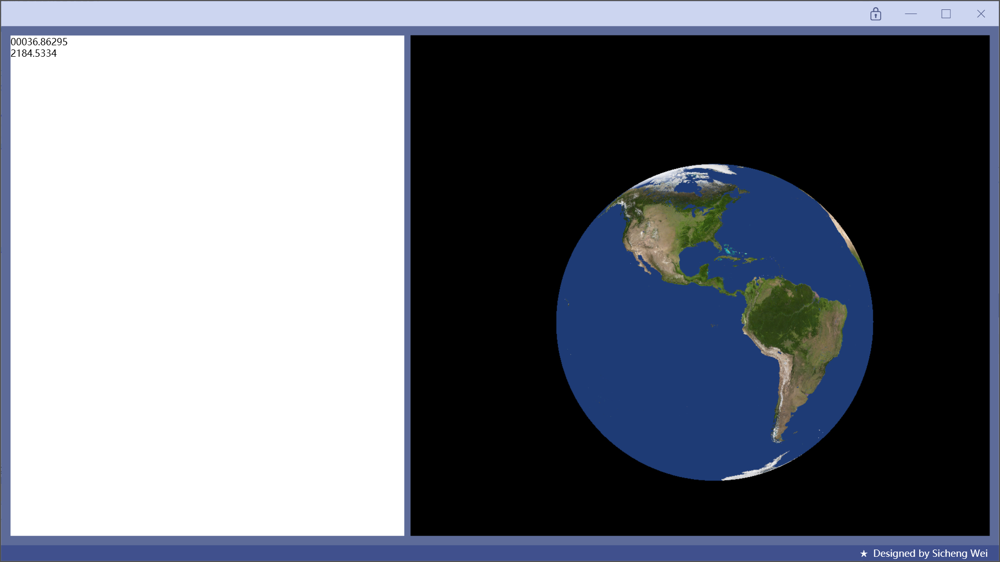
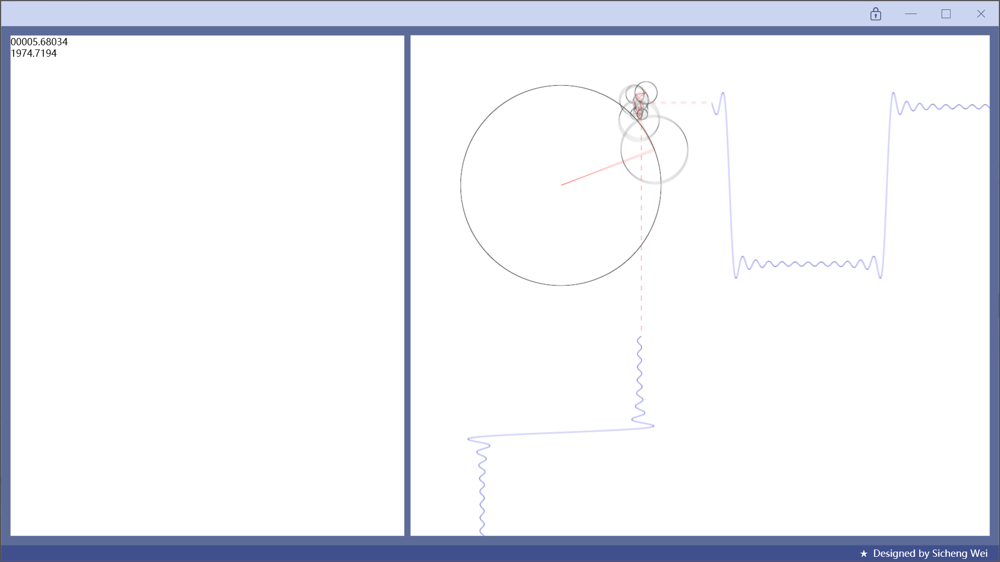

# GLWpfShadertoy

GLWpfShadertoy is a tiny **C#-WPF Shader project** adapted from the shader website [Shadertoy](https://www.shadertoy.com/).

## Introduction
The UI framework for this project is WPF.

[OpenTK](https://github.com/opentk/opentk) and [OpenTK.GLWpfControl](https://github.com/opentk/GLWpfControl) are imported to enable controlling OpenGL.

For the API of Shadertoy, refer to [Shadertoy Documentation](https://www.shadertoy.com/howto).


## Example Showcase
The current Shader can run a simulation of earth sphere, and can change the viewing with Keyboard WASDQE.




## Usage
All the necessary shader documents, including **fragment shader** and **vertex shader** are in the [./Shader](https://github.com/Sicheng-Wei/GLWpfShadertoy/tree/main/GLWpfShadertoy/Shader) file.

Refer to the [./Resources](https://github.com/Sicheng-Wei/GLWpfShadertoy/tree/main/GLWpfShadertoy/Resources) file to import your own texture map.

This project now cannot fully support all the APIs in Shadertoy, but you can run all single-file shaders from [Shadertoy](https://www.shadertoy.com/) to see the results.

Please refer to the [Shader.frag](https://github.com/Sicheng-Wei/GLWpfShadertoy/blob/main/GLWpfShadertoy/Shader/Shader.frag), and replace line 10 to line 68 with the Shadertoy code.

For instance, to run this interesting [wave simulation shader](https://www.shadertoy.com/view/4tXSzM), the fragment shader are as follows:
```c
#version 330 core

// WPF-Shadertoy Transfer Macros
uniform vec2    iResolution;
uniform float   iTime;
uniform vec3    iMouse;             // TODO; Add Mouse
out vec4 fragColor;
vec2 fragCoord = gl_FragCoord.xy;


/***  Replace Starts here  ***/

// evening sketch by @mmalex
// having a go at re-creating @vector_gl's lovely gif https://twitter.com/Vector_GL/status/612337298064150529
// now with triangle wave!

#define moblur 4
#define harmonic 25
#define triangle 1 // comment this line out for only square

vec3 circle(vec2 uv, float rr, float cc, float ss) {
    
    uv*=mat2(cc,ss,-ss,cc);
    if (rr<0.) uv.y=-uv.y;
    rr=abs(rr);
    float r = length(uv)-rr;
    float pix=fwidth(r);
	float c = smoothstep(0.,pix,abs(r));
    float l = smoothstep(0.,pix,abs(uv.x)+step(uv.y,0.)+step(rr,uv.y));
   	return vec3(c,c*l,c*l);
}
vec3 ima(vec2 uv, float th0) {
    vec3 col=vec3(1.0);
    vec2 uv0=uv;
   	th0-=max(0.,uv0.x-1.5)*2.;
   	th0-=max(0.,uv0.y-1.5)*2.;
#ifndef triangle
float lerpy = 1.;
#else
float lerpy =smoothstep(-0.6,0.2,cos(th0*0.1));
#endif

    for (int i=1;i<harmonic;i+=2) {
        float th=th0*float(i);
        float fl=mod(float(i),4.)-2.;// used to be repeated assignment fl=-fl, but compiler bugs. :(
        float cc=cos(th)*fl,ss=sin(th);
        float trir=-fl/float(i*i);
        float sqrr=1./float(i);
        float rr=mix(trir,sqrr,lerpy);
        col = min(col, circle(uv,rr,cc,ss));
        uv.x+=rr*ss;
        uv.y-=rr*cc;
    }
    float pix=fwidth(uv0.x);
    if (uv.y>0. && fract(uv0.y*10.)<0.5) col.yz=min(col.yz,smoothstep(0.,pix,abs(uv.x)));
    if (uv.x>0. && fract(uv0.x*10.)<0.5) col.yz=min(col.yz,smoothstep(0.,pix,abs(uv.y)));
    if (uv0.x>=1.5) col.xy=vec2(smoothstep(0.,fwidth(uv.y),abs(uv.y)));    
    if (uv0.y>=1.5) col.xy=vec2(smoothstep(0.,fwidth(uv.x),abs(uv.x)));    
    return col;
}
void mainImage( out vec4 fragColor, in vec2 fragCoord )
{
	vec2 uv = fragCoord.xy / iResolution.yy;
    uv.y=1.-uv.y;
    uv*=5.;
    uv-=1.5;
    float th0=iTime*2.;
    float dt=2./60./float(moblur);
    vec3 col=vec3(0.);
    for (int mb=0;mb<moblur;++mb) {
    	col+=ima(uv,th0);
        th0+=dt;
    }
    col=pow(col*(1./float(moblur)),vec3(1./2.2));
    fragColor=vec4(col,1.);
}

/***  Replace Ends here  ***/

void main(){
    mainImage(fragColor, fragCoord);
}
```



## Todo List
- Textbox UI Component: More convenient coding.
- Full Support of Shadertoy API


##
### Triangle Realization (Previous Branch & Blog)

Triangle Based on GLWpfControl: https://github.com/Sicheng-Wei/GLWpfShadertoy/tree/triangle

CSDN Page: https://blog.csdn.net/weixin_45659458/article/details/127681319

